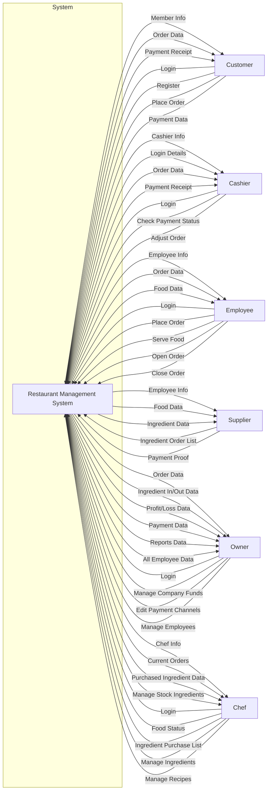
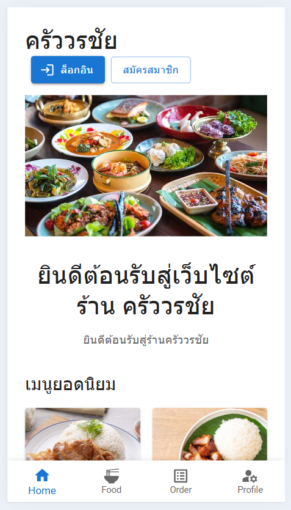
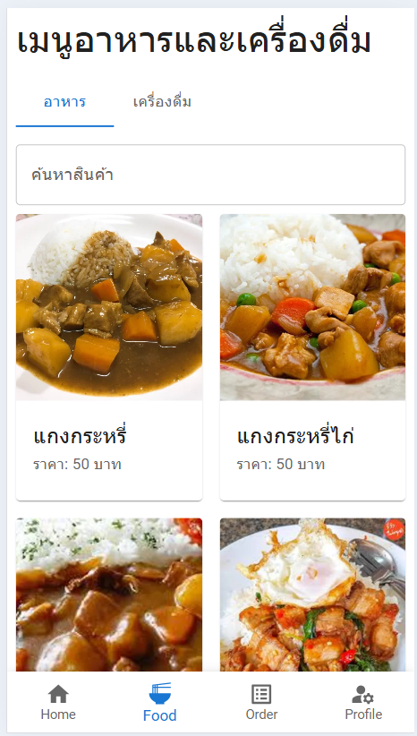
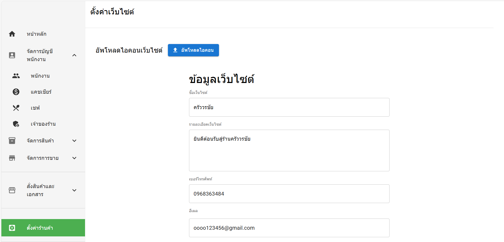

# Welcome to Restaurant Pos Mern

## ขั้นตอนการติดตั้ง

    npm install

## วิธีการใช้งาน
**frontend**

    cd restaurant-pos-mern/frontend 
    npm run dev

**backend**

    cd restaurant-pos-mern/frontend
    npm run start

## เครดิต

# 🍽️ Restaurant Management Web Application

เว็บแอปพลิเคชันสำหรับการบริหารจัดการร้านอาหารแบบครบวงจร ครอบคลุมตั้งแต่การจัดการการสั่งอาหาร การชำระเงิน การจัดการสต็อกวัตถุดิบ เมนูอาหาร ไปจนถึงการบริหารจัดการข้อมูลพนักงาน พัฒนาขึ้นในปี **2567**

---

## ✨ Features (คุณสมบัติหลัก)

แอปพลิเคชันนี้ออกแบบมาเพื่อช่วยให้การดำเนินงานของร้านอาหารเป็นไปอย่างราบรื่นและมีประสิทธิภาพ:

* **ระบบจัดการการสั่งอาหาร (Order Management):** รับและติดตามสถานะคำสั่งซื้อจากลูกค้าได้อย่างรวดเร็ว
* **ระบบจัดการการชำระเงิน (Payment Processing):** รองรับการบันทึกและจัดการวิธีการชำระเงินที่หลากหลาย
* **ระบบจัดการวัตถุดิบ (Inventory Management):** ติดตามปริมาณสต็อกวัตถุดิบ แจ้งเตือนเมื่อวัตถุดิบเหลือน้อย และช่วยคำนวณต้นทุนเบื้องต้น
* **ระบบจัดการเมนูอาหาร (Menu Management):** เพิ่ม, แก้ไข, ลบ และจัดหมวดหมู่เมนูอาหารได้อย่างง่ายดาย
* **ระบบบริหารจัดการพนักงาน (Employee Management):** จัดการข้อมูลพนักงาน ตำแหน่ง และสิทธิ์การเข้าถึง

---

## 🛠️ Technology Stack (เทคโนโลยีที่ใช้)

แอปพลิเคชันนี้ถูกสร้างขึ้นด้วยเทคโนโลยีที่ทันสมัยและมีประสิทธิภาพ:

### 🚀 Frontend

| องค์ประกอบ | เทคโนโลยี | รายละเอียด |
| :--- | :--- | :--- |
| **Framework** | **React** | สำหรับการสร้างส่วนต่อประสานกับผู้ใช้ (User Interface) |
| **Language** | **TypeScript** | เพื่อเพิ่มความเสถียรและความสามารถในการจัดการโค้ดขนาดใหญ่ |
| **UI Library** | **MUI (Material-UI)** | สำหรับการออกแบบและสร้างส่วนติดต่อผู้ใช้ที่สวยงามและใช้งานง่ายตามหลัก Material Design |
| **Architecture** | **Model-View-Controller (MVC)** | สถาปัตยกรรมสำหรับการแยกส่วนการจัดการข้อมูล, การแสดงผล, และการควบคุมการทำงานของแอปพลิเคชัน |

### ⚙️ Backend & Database

| องค์ประกอบ | เทคโนโลยี | รายละเอียด |
| :--- | :--- | :--- |
| **Language** | **JavaScript** | เป็นภาษาโปรแกรมที่นักพัฒนาใช้ในการสร้างหน้าเว็บแบบอินเทอร์แอคทีฟ ตั้งแต่การรีเฟรชฟีดสื่อโซเชียลไปจนถึงการแสดงภาพเคลื่อนไหวและแผนที่แบบอินเทอร์แอคทีฟ ฟังก์ชันของ JavaScript สามารถปรับปรุงประสบการณ์ที่ผู้ใช้จะได้รับจากการใช้งานเว็บไซต์ และในฐานะที่เป็นภาษาในการเขียนสคริปต์ฝั่งไคลเอ็นต์ |
| **Runtime** | **Node.js** | สภาพแวดล้อมสำหรับการทำงานของ JavaScript นอกเบราว์เซอร์ |
| **Framework** | **Express** | Web Application Framework สำหรับการสร้าง API ที่รวดเร็วและยืดหยุ่น |
| **Database** | **MongoDB** | ฐานข้อมูล NoSQL ที่มีความยืดหยุ่นสูง เหมาะสำหรับการจัดการข้อมูลที่ไม่เป็นโครงสร้างตายตัว |
| **ODM** | **Mongoose** | Object Data Modeling (ODM) library สำหรับการเชื่อมต่อและจัดการข้อมูล MongoDB ในสภาพแวดล้อม Node.js |

---

## 🏗️ Project Structure (โครงสร้างโปรเจกต์)

โครงสร้างทั่วไปของโปรเจกต์จะถูกแบ่งออกเป็นส่วน Frontend และ Backend เพื่อการบำรุงรักษาและขยายระบบในอนาคต:

## Context diagram

Example Frontend 

